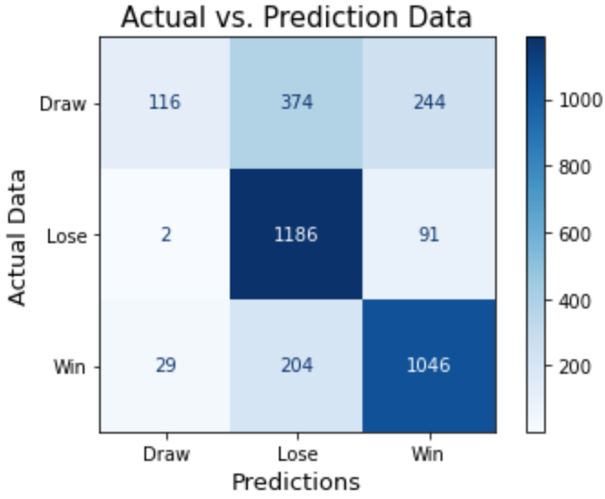

# Prediction of match results in English Premier League based on football statistics

L.T. Ozgur Yildirim

### Index:

* [Purpose of the study](#section1)
* [Materials and Methods](#section2)
* [Tableau](#section3)
* [Model Pipeline](#section4)
* [Conclusion](#section5)
* [Glossary](#section6)
* [Files](#section7)
* [References](#section8)
* [License](#section9)

### Purpose of the study

In this project, I am working as data analyst for a company related to football statistics. My company created machine learning models to predict the results of matches in English Premier League based on football statistics. 
The main objectives of this study are 1) analyzing relationships between football statistics, and 2) building classification models to predict the predict the results of football matches based on football statistics.

### Materials and Methods

The football statistics in the dataset are scraped on https://fbref.com/en/ website using BeautifulSoup library. The tables in the dataset include shooting, passing, goalkeeping, passing types, goal and shot creation, defense, possession, and miscellaneous statistics (Figure 1). After scraping, the tables are exported as .csv files into csv_main and csv_validation folders.
The dataset consists of statistics of 27 teams in the premier league ranging from 2013 season to 2022 season. The main_data include statistics from 2018-2022 seasons to train the classification models. The validation_data include statistics from 2013-2017 seasons to test/validate the classification models.
Moreover, Premier League standings for the last 22 seasons (from kaggle.com) are used to analyze the championship and relegation numbers of the teams. The epl_standings.csv file is stored in csv_main folder.
The studies are performed on .csv and excel files using Python and Tableau softwares.

Figure 1

A few NaN values in the dataset are replaced by mean value of the columns. No outliers were observed in the dataset. After that, the features are selected using variance threshold and KBEST methods to prepare the dataset for the classification models. After the results are obtained, the results are exported as .csv and excel files. Extra excel files of dataset are created using Python to compare actual data and predicted data in Tableau.

The methods of this study include the followings:
* Web scraping
* Get data
* Exploratory data analyses
* Data cleaning
* Data visualization
* Data wrangling
* Variance threshold
* KBEST
* Hyperparameters search
* Model Pipeline
* Apply Random Forest Classifier Model
* Evaluate the results

### Tableau

[Link to Tableau](https://public.tableau.com/views/Final_Project_16672523365700/Relegationnumbers?:language=en-US&:display_count=n&:origin=viz_share_link)

The .csv and excel files are imported into Tableau. The football statistics are plotted to visualize and observe their relations in Tableau.

### Model Pipeline

The columns contributing to the prediction of the results in cleaned data are selected using Variance Threshold and KBEST methods. The model pipeline includes random forest classifier, decision tree classifier and logistic regression models. Hyperparameters for random forest classifier and decision tree classifier are searched using gridsearch method. Then, the models are trained using the train portion of the main_data in the pipeline. The model with the best accuracy after using the test portion of the main_data is random forest classifier model.

The steps above are applied for the validation_data (2013-2017 seasons). The accuracy score of the random forest classifier applied on the validation_data is 0.77. The comparison of actual win, draw, and lose data and predicted win, draw, and lose results are shown in confusion matrix of the validation_data (Figure 2).

There are 3292 predictions of the match results in validation data (2013-2017 season).
It was predicted that the relevant team would win in 1381 matches. The actual data shows that the relevant team would win in 1046 matches.
It was predicted that the relevant team would lose in 1764 matches. The actual data shows that the relevant team would lose in 1186 matches.
It was predicted that the relevant team would draw in 147 matches. The actual data shows that the relevant team would draw in 116 matches.

The random forest classifier's accuracy is pretty good. Random Forest Classifier Model Results_Seasons(2013-2017)

 Accuracy Score:  0.71
 
 Precision: 0.76
 
 Recall: 0.77
 
 F1: 0.76
 
 Figure 2
 
 
 
 

### Conclusion

This study investigates the results of matches in English Premier League in seasons 2013-2022 based on football statistics using classification models.
The random forest classifier model is selected as it has the best accuracy score. The confusion matrix shows that the model predicts well (accuracy Score:  0.71) about the results of the matches. The future study can be prediction of football matches which are going to be played in the future.

### Glossary

The files with descriptions of the statistics in the dataset are located at "glossary" folder.

### Files
csv_main: season 2018-2022 data exported from Python and imported to Tableau

csv_validation: season 2013-2017 data exported from Python and imported to Tableau

excel_files: exported from Python and imported to Tableau

glossary: descriptions of statistics in the dataset

images: images of visualized data in dataset

pickle: saved data of models, encoder, transformer.

presentation: pdf file of the presentation

.ipynb files: Jupiter notebook files

### References
The dataset is scraped from https://fbref.com/en/ website. Moreover, Premier League standings for the last 22 seasons (https://www.kaggle.com) is used. Lecture notes from the web scraping lessons in Ironhack Data Analytics Bootcamp and web scraping videos of Dataquest channel are used to complete web scraping part of this project.

### License
This is an educational project; therefore, all materials can be used freelly.
